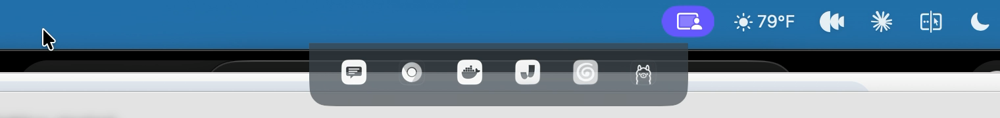

# DropNotch

Hover over your MacBook's notch to see the menu bar icons hiding behind it — and click them.



macOS quietly parks overflow menu bar items under and to the left of the notch, where they're invisible and unclickable. DropNotch drops down a translucent panel with live images of those hidden icons; clicking one activates the real status item (its menu opens as if you'd clicked it in the menu bar).

## Features

- Instant hover trigger on the notch, slide-down panel that matches the menu bar look
- Live pixel captures of hidden icons (battery %, dynamic icons stay current), app-icon fallback
- Click forwarding via Accessibility with synthetic-click fallback
- Tooltips mirror the real items' help text
- Cmd+drag reorders icons in the panel (live reflow, persisted); releasing a cmd+drag up in the menu bar replays a real cmd+drag on the underlying item — note this only moves items macOS still gives a window (most hidden items have none; the OS destroys them, so there's nothing on screen to drag)
- Own status item: Pause, Launch at Login (on by default; toggle off sticks), Quit
- Nothing hidden = no panel
- Panel never steals focus

## Requirements

- macOS 14+ (built for a notched MacBook; idles politely without one)
- Permissions: **Screen Recording** (live icon images) and **Accessibility** (click forwarding). DropNotch never asks at launch — pick **Grant Permissions…** from its menu bar item when you're ready. Without them it still runs, with static app icons and no click forwarding.

## Build

```sh
./scripts/make-app.sh
open build/DropNotch.app
```

Signs with your Apple Development certificate when available (keeps TCC grants stable across rebuilds), ad-hoc otherwise.

Tests: `swift test`

## How it works

- **Detection** — the Accessibility API enumerates each app's status items (authoritative, one entry per real item); items positioned under or left of the notch, or off-screen, are hidden. A CGWindowList fallback covers the no-Accessibility case.
- **Capture** — ScreenCaptureKit single-frame window captures, matched to items by owner and menu-bar geometry.
- **Click** — `AXPress` on the item's AX element (with a wake-up retry for stale app connections), `AXShowMenu` and synthetic click as fallbacks.

Design and implementation notes live in `docs/superpowers/`.
